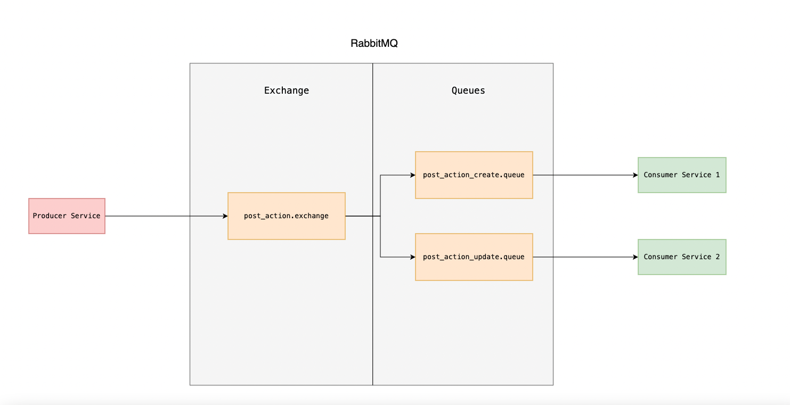

# AMQP POC

## Overview

The purpose of this project is to represent the working of RabbitMQ using AMQP 0-9-1 Model. 

To simulate a real world scenario of deploying the application in a microservice environment, we have used docker-compose in which we are orchestrating the 3 container services containing of 1 producer & 2 consumers.

The producers and consumers codebase is written is NodeJS using package `amqplib` 



---

## RabbitMQ**


RabbitMQ is a message-queueing tool that acts as a message broker (delivering messages from one place to another) and queue manager.

RabbitMQ message broker acts as a middleman between the producer and consumer services. It can be used to reduce loads of the application server by queueing the input requests and load balancing it as per the processing capacity of the consumer servers. 


The diagram above represents the basic components of RabbitMQ

- Producer
- Broker
- Consumer

Producer is a application service (microservice) that publishes the message to RabbitMQ in order for that message to be delivered to the consumer microservice.

In a general microservice environment, for message transfer between 2 microservices can be done either by using REST APIs, Socket Connections etc, in this approach the message transfer is done through the MQ Service (RabbitMQ) in which the producer service publishes the message to the MQ and forget about it, the MQ then ensures the delivery of this message to the consumer service.

### Terminologies & Concepts

- **Producer**: Application that sends the messages.
- **Consumer**: Application that receives the messages.
- **Queue**: Buffer that stores messages.
- **Message**: Information that is sent from the producer to a consumer through RabbitMQ.
- **Connection**: A TCP connection between your application and the RabbitMQ broker.
- **Channel**: A virtual connection inside a connection. When publishing or consuming messages from a queue - it's all done over a channel.
- **Exchange**: Receives messages from producers and pushes them to queues depending on rules defined by the exchange type. To receive messages, a queue needs to be bound to at least one exchange.
    - Type of exchanges
        - direct: Routes the messages to the queue matching the routing key declared by the queue at the time of binding.
        - fanout: Routes the messages to all the queues binded to the exchange.
        - topic: Routes messages to queues whose routing key matches all, or a portion of a routing key.
        - headers: Routes the messages based upon a matching of message headers to the expected headers specified by the binding queue.
- **Binding**: A binding is a link between a queue and an exchange.
- **Routing key**: A key that the exchange looks at to decide how to route the message to queues. Think of the routing key like an address for the message.
- **AMQP**: Advanced Message Queuing Protocol is the protocol used by RabbitMQ for messaging.
- **Users**: It is possible to connect to RabbitMQ with a given username and password. Every user can be assigned permissions such as rights to read, write and configure privileges within the instance. Users can also be assigned permissions for specific virtual hosts.
- **Vhost, virtual host**: Provides a way to segregate applications using the same RabbitMQ instance. Different users can have different permissions to different vhost and queues and exchanges can be created, so they only exist in one vhost.

### Usage

- Install docker & docker-compose in your system based on the respective platform
- In the root directory of the project run

```
docker-compose up
```

- Services will take around 30-60 seconds to come up and once all services are up you should be seeing logs of PRODUCER and CONSUMER services publishing and receiving messages.
- RabbitMQ dashboard can be accessed from `http://localhost:15672` 
    - username/password = guest


### References

- [Docker Installation](https://docs.docker.com/engine/install/)
- [Docker Compose Installation](https://docs.docker.com/compose/install/)
- [RabbitMQ AMQP 0-9-1 Model](https://www.rabbitmq.com/tutorials/amqp-concepts.html)
- [RabbitMQ Exchanges](https://www.rabbitmq.com/tutorials/amqp-concepts.html#exchanges)
- [NodeJS Package `AMQPLIB`](https://www.npmjs.com/package/amqplib)